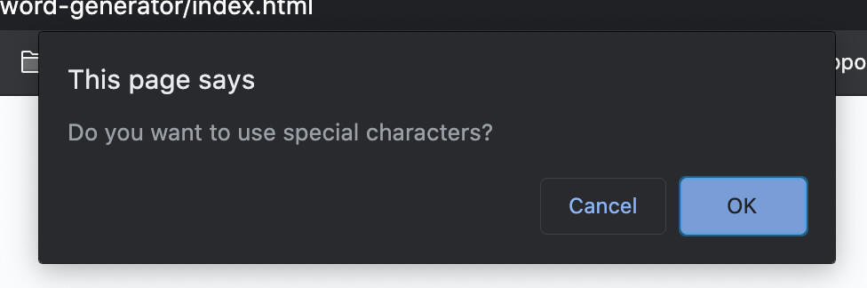

# my-password-generator

## Table of Contents

* [Objective](#Objective)
* [Description](#Description)
* [Installation](#installation)
* [Usage](#usage)
* [Credits](#credits)

 ## Objective
 
 - To build a generator that allows the user to select a specific number of characters and the character make up (lowercase, uppercase, numbers, and/or special characters) to create a password. 
 
 ## Description
 
 [GitHub](https://github.com/mbostwick1/my-password-generator)
 
 [Live URL](https://mbostwick1.github.io/my-password-generator/)
 
 - This project required me to become very familiar with JavaScript, apply the concepts learned in class, research concepts we only briefly touched on, and figure out how to piece it all together to create a password generator that uses specific criteria from the user.

## Installation
 
 - Created a repo on GitHub and cloned it to my local drive.
 
 - Added provided files (html, css, and js) to my-password-generator folder.
 
 - After looking through all files, I took a stab at adding prompts/confirms to get the user's input. While things did work, there were elements that didn't provide a good user experience. 
 
    LIST of issues:
    * If the user enters anything outside of 8 - 128, the user would get an alert but it would not allothe user to try again. 
    * I was asking the user for input but had no way to store the answers. Missing variables. 
    * Working in the wrong function.
    
    Therefore, I realized I needed to do some digging into my notes and hit google.
    
- I copy and pasted my previous code attempt to a new file. While it wasn't completely correct, it also was not completely wrong.
    
    - Inside the generate password function, I first established my variables. 
    
    - I worked on the while loop that prompts the user to choose a number between 8 and 128. I was ablee to pull from my previous code and add to this while statement while also adding if, if else statements to address the issues before. Not only to look for a number in the set given but to throw alerts when a number is not entered *isNan* or if the user immediately hits cancel *null*.
    
    - The next while loop contained the confirms for lowercase, uppercase, numbers, and special characters. Note: This is where I used the wrong variable for the password. Thankfully, I caught it quickly in the end.
    
    - I added an if/else to confirm the user would select at least 1 character option.
    
    - Lastly, I created the for loop to generate the actual password using the user input provided and replace the return with the generated password function.
    
    - While things appeared to work at first, I was generating all variables and was throwing undefined errors. This told me that the users input was not being used. I discovered I had used the incorrect variable to log the user input.
    
    - Volia! Generating passwords!
        
 
 ## Usage
 
- GIVEN I need a new, secure password
- WHEN I click the button to generate a password
- THEN I am presented with a series of prompts for password criteria
- WHEN prompted for password criteria
- THEN I select which criteria to include in the password
- WHEN prompted for the length of the password

- THEN I choose a length of at least 8 characters and no more than 128 characters

- WHEN prompted for character types to include in the password

- THEN I choose lowercase, uppercase, numeric, and/or special characters

- WHEN I answer each prompt

- THEN my input should be validated and at least one character type should be selected

 

- WHEN all prompts are answered

- THEN a password is generated that matches the selected criteria

- WHEN the password is generated

- THEN the password is either displayed in an alert or written to the page

## Credits

[Stack Overflow Forums](https://stackoverflow.com/)
[W3 Schools JS](https://www.w3schools.com/js/)
[MDN web docs](https://developer.mozilla.org/en-US/)
